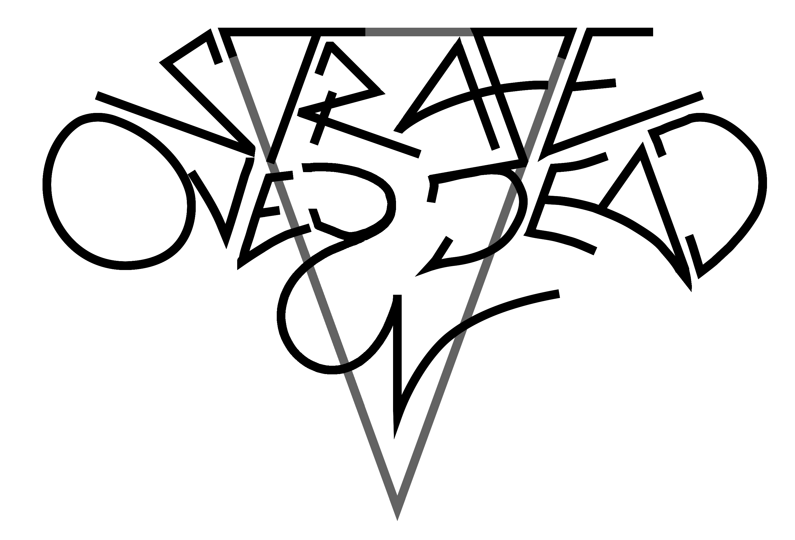

#Ce este
Strafe Overdead este un joc 2D topdown action rpg cu grafica de tip pixelart realizat in framework-ul libGDX.
#Cum joci
Pentru a rula jocul se poate accesa fisierul jar din proiectul desktop pe MacOS, Linux si Windows, iar pe Android se instaleaza apk-ul. Comenzile de baza sunt WASD pentru a te misca, space pentru dash si escape pentru pauza.
# Detalii versiuni

|  \\_____________________________/ | Windows/Linux/MacOS|Android   |
|---|---|---|
  | Fullscreen |    da  |da   |
  |V-Sync|da|default unde este posibil|
| FPS (pe display-urile pe care a fost testat)  |   pana la 144|  pana la 90 |
| Input   |mouse&tastatura/controller   | touchscreen / mouse&tastatura  |
